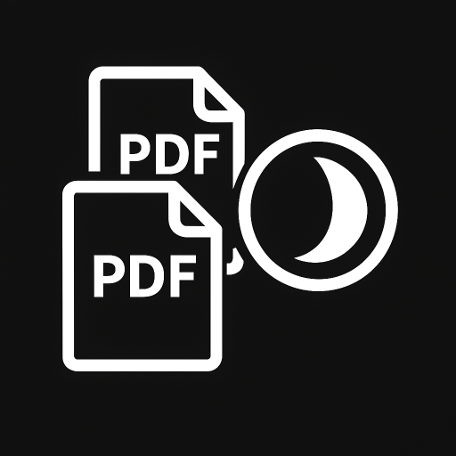

<div align="center">



# PDF Enhancer

### Dark Mode Converter · PDF Merger · PDF to Word Exporter

A lightweight Windows desktop app that batch converts PDFs to dark mode, merges multiple PDFs into one, and exports PDFs into editable Word documents, all from a clean dark themed interface.

<br/>


</div>

---

## Table of Contents

- [Overview](#overview)
- [Features](#features)
- [Tech Stack](#tech-stack)
- [Getting Started](#getting-started)
- [Usage Guide](#usage-guide)
- [Building a Standalone Executable](#building-a-standalone-executable)
- [Project Structure](#project-structure)
- [Notes and Limitations](#notes-and-limitations)
- [Roadmap](#roadmap)
- [License](#license)

---

## Overview

**PDF Enhancer** is a desktop utility built with Python and Tkinter that streamlines three of the most common PDF chores into one simple app:

1. **Read PDFs comfortably at night** by inverting pages into a true dark theme.
2. **Combine documents** by merging several PDFs into a single file.
3. **Reuse content** by exporting PDFs into editable Word (`.docx`) documents.

Everything runs locally on your machine. No files are uploaded anywhere, and no internet connection is required to process documents.

---

## Features

- 🌙 **Dark Mode Conversion** : inverts white backgrounds to black and dark text to light, page by page.
- 🔗 **PDF Merging** : combine any number of PDFs into one document in the order you select.
- ⚡ **Convert and Merge** : invert to dark mode and merge in a single action.
- 📝 **PDF to Word (.docx)** : turn PDFs into editable Word documents powered by `pdf2docx`.
- 📂 **Batch Processing** : queue and process multiple files at once.
- 📊 **Live Progress** : a real time progress bar and status label for every operation.
- 🧵 **Responsive UI** : conversions run on background threads so the window never freezes.
- 🎨 **Custom Branding** : a dark themed interface with a custom app and window icon.
- 💼 **Standalone Executable** : ships as a single `.exe`, no Python installation required for end users.

---

## Tech Stack

| Layer | Technology | Role |
| --- | --- | --- |
|  | **Python 3** | Core application language |
|  | **Tkinter / ttk** | Native desktop GUI (standard library) |
|  | **PyMuPDF (fitz)** | Rendering, merging, and rasterizing PDF pages |
|  | **Pillow (PIL)** | Color inversion and header icon processing |
|  | **pdf2docx** | Converting PDFs into editable `.docx` files |
|  | **PyInstaller** | Packaging the standalone Windows executable |

---

## Getting Started

### Prerequisites

- **Python 3.8 or newer** (Windows)
- **pip** for installing dependencies

### Installation

```bash
# 1. Clone the repository
git clone https://github.com/BhanukaJanappriya/pdf-enhancer.git
cd pdf-enhancer

# 2. (Optional) create a virtual environment
python -m venv venv
venv\Scripts\activate

# 3. Install dependencies
pip install -r requirements.txt
```

### Run the App

```bash
python app.py
```

The application window opens with the custom icon, a file list, a progress bar, and action buttons.

---

## Usage Guide

1. **Select PDF Files** — click *Select PDF Files* and choose one or more PDFs. Duplicate selections are ignored automatically.
2. **Pick an action:**

   | Button | What it does | Output |
   | --- | --- | --- |
   | **Convert to Dark Mode** | Inverts each PDF to a dark theme | `<name>_dark.pdf` beside each source file |
   | **Merge PDFs** | Combines the listed PDFs into one | A single PDF at the location you choose |
   | **Convert & Merge** | Inverts, then merges into one file | A single dark mode PDF at your chosen location |
   | **Convert to Word (.docx)** | Exports each PDF to an editable Word file | `<name>.docx` beside each source file |

3. **Watch the progress bar** and wait for the success message.
4. **Clear Files** resets the list whenever you want to start over.

> **Tip:** After running a dark mode conversion, the merge action uses the converted files. Click *Clear Files* and reselect if you want to merge the original PDFs instead.

---

## Building a Standalone Executable

To generate a single portable `.exe` that runs without Python:

```bash
pip install pyinstaller

pyinstaller --onefile --windowed ^
  --name "PDF-DarkMode-Converter" ^
  --icon "app_icon.ico" ^
  --add-data "favicon.png;." ^
  --add-data "app_icon.ico;." ^
  --collect-all pdf2docx ^
  app.py
```

The finished executable appears in the `dist/` folder as `PDF-DarkMode-Converter.exe`.

On Windows you can also just double click **`build_app.bat`**, which converts your favicon, installs the dependencies, and builds the executable for you.

---

## Project Structure

```
pdf-enhancer/
├── app.py                  # Main application (UI + PDF logic)
├── convert_favicon.py      # Converts a favicon image into app_icon.ico
├── build_app.bat           # One click Windows build script
├── requirements.txt        # Python dependencies
├── favicon.png             # Source app icon
├── app_icon.ico            # Window / executable icon
├── dist/                   # Built executable (generated, git ignored)
└── README.md
```

---

## Notes and Limitations

- **Dark mode output is rasterized.** Each page is rendered to an image, so text in the `_dark.pdf` is no longer selectable or searchable.
- **Conversion speed.** Dark mode inversion is performed pixel by pixel, so very large or many page PDFs take longer to process.
- **Word conversion fidelity.** `pdf2docx` reconstructs layout heuristically. Complex layouts, scanned pages, or unusual fonts may not map perfectly into Word.
- **Executable size.** Bundling `pdf2docx` pulls in OpenCV, so the standalone `.exe` is large by design.

---

## Roadmap

- [ ] Adjustable dark mode themes (custom background and text colors)
- [ ] Preserve selectable text in dark mode output
- [ ] Drag and drop file support
- [ ] Cross platform builds (macOS and Linux)
- [ ] Page range selection for conversion and export

---

## License

Released under the **MIT License**. You are free to use, modify, and distribute this project.

<div align="center">

Made with Python and Tkinter · Built for readable, editable, and merge friendly PDFs

</div>
